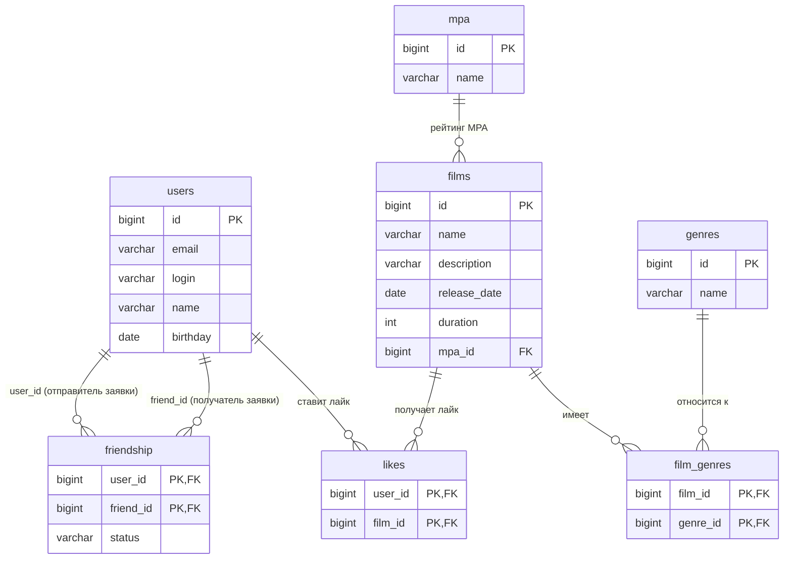

# java-filmorate

Приложение для учёта фильмов и пользователей: лайки, дружба, жанры, рейтинги MPA.

## Схема базы данных

Схема приведена к нормальным формам:
- каждый столбец хранит атомарное значение (1НФ);
- неключевые атрибуты зависят от полного первичного ключа (2НФ);
- нет транзитивных зависимостей (3НФ).

Справочники `mpa` и `genres` вынесены отдельно. Связи «многие-ко-многим» реализованы через таблицы-связки `film_genres` и `likes`. Дружба хранится в `friendship` с явным статусом.



### Описание таблиц

| Таблица        | Назначение                                                                 |
|----------------|----------------------------------------------------------------------------|
| **users**      | Пользователи                                                               |
| **films**      | Фильмы; ссылка на рейтинг MPA                                              |
| **mpa**        | Справочник рейтингов MPA                                                   |
| **genres**     | Справочник жанров                                                          |
| **film_genres**| Связь фильм ↔ жанр (многие-ко-многим)                                     |
| **likes**      | Лайки пользователей фильмам (многие-ко-многим)                             |
| **friendship** | Заявки/дружба: `user_id` отправил заявку `friend_id`, `status` — статус    |

### Справочные данные (пример)

**mpa**

| id | name  |
|----|-------|
| 1  | G     |
| 2  | PG    |
| 3  | PG-13 |
| 4  | R     |
| 5  | NC-17 |

**genres**

| id | name           |
|----|----------------|
| 1  | Комедия        |
| 2  | Драма          |
| 3  | Мультфильм     |
| 4  | Триллер        |
| 5  | Документальный |
| 6  | Боевик         |

### DDL (кратко)

```sql
CREATE TABLE mpa (
    id   INTEGER PRIMARY KEY,
    name VARCHAR(10) NOT NULL UNIQUE
);

CREATE TABLE genres (
    id   INTEGER PRIMARY KEY,
    name VARCHAR(50) NOT NULL UNIQUE
);

CREATE TABLE users (
    id       BIGINT GENERATED BY DEFAULT AS IDENTITY PRIMARY KEY,
    email    VARCHAR(255) NOT NULL,
    login    VARCHAR(100) NOT NULL,
    name     VARCHAR(255),
    birthday DATE NOT NULL
);

CREATE TABLE films (
    id           BIGINT GENERATED BY DEFAULT AS IDENTITY PRIMARY KEY,
    name         VARCHAR(255) NOT NULL,
    description  VARCHAR(200),
    release_date DATE NOT NULL,
    duration     INTEGER NOT NULL CHECK (duration > 0),
    mpa_id       INTEGER REFERENCES mpa (id)
);

CREATE TABLE film_genres (
    film_id  BIGINT  NOT NULL REFERENCES films (id) ON DELETE CASCADE,
    genre_id INTEGER NOT NULL REFERENCES genres (id),
    PRIMARY KEY (film_id, genre_id)
);

CREATE TABLE likes (
    film_id BIGINT NOT NULL REFERENCES films (id) ON DELETE CASCADE,
    user_id BIGINT NOT NULL REFERENCES users (id) ON DELETE CASCADE,
    PRIMARY KEY (film_id, user_id)
);

CREATE TABLE friendship (
    user_id   BIGINT      NOT NULL REFERENCES users (id) ON DELETE CASCADE,
    friend_id BIGINT      NOT NULL REFERENCES users (id) ON DELETE CASCADE,
    status    VARCHAR(20) NOT NULL CHECK (status IN ('UNCONFIRMED', 'CONFIRMED')),
    PRIMARY KEY (user_id, friend_id),
    CHECK (user_id <> friend_id)
);
```

## Примеры SQL-запросов основных операций

### Пользователи

```sql
-- Все пользователи
SELECT * FROM users;

-- Пользователь по id
SELECT * FROM users WHERE id = ?;

-- Создать пользователя
INSERT INTO users (email, login, name, birthday)
VALUES (?, ?, ?, ?);

-- Обновить пользователя
UPDATE users
SET email = ?, login = ?, name = ?, birthday = ?
WHERE id = ?;
```

### Дружба

```sql
-- Отправить заявку в друзья (A → B)
INSERT INTO friendship (user_id, friend_id, status)
VALUES (?, ?, 'UNCONFIRMED');

-- Подтвердить дружбу (B принимает заявку A)
-- Вариант 1: обновить статус существующей записи
UPDATE friendship
SET status = 'CONFIRMED'
WHERE user_id = ? AND friend_id = ?;

-- Вариант 2 (часто используемый): при подтверждении создать обратную связь
INSERT INTO friendship (user_id, friend_id, status)
VALUES (?, ?, 'CONFIRMED');  -- B → A
UPDATE friendship
SET status = 'CONFIRMED'
WHERE user_id = ? AND friend_id = ?;  -- A → B

-- Удалить из друзей (обе стороны)
DELETE FROM friendship
WHERE (user_id = ? AND friend_id = ?)
   OR (user_id = ? AND friend_id = ?);

-- Список друзей пользователя (только подтверждённые)
SELECT u.*
FROM users u
JOIN friendship f ON u.id = f.friend_id
WHERE f.user_id = ? AND f.status = 'CONFIRMED';

-- Общие друзья двух пользователей
SELECT u.*
FROM users u
JOIN friendship f1 ON u.id = f1.friend_id AND f1.user_id = ? AND f1.status = 'CONFIRMED'
JOIN friendship f2 ON u.id = f2.friend_id AND f2.user_id = ? AND f2.status = 'CONFIRMED';
```

### Фильмы

```sql
-- Все фильмы (с MPA)
SELECT f.*, m.name AS mpa_name
FROM films f
LEFT JOIN mpa m ON f.mpa_id = m.id;

-- Фильм по id + жанры
SELECT f.*, m.name AS mpa_name
FROM films f
LEFT JOIN mpa m ON f.mpa_id = m.id
WHERE f.id = ?;

SELECT g.id, g.name
FROM genres g
JOIN film_genres fg ON g.id = fg.genre_id
WHERE fg.film_id = ?
ORDER BY g.id;

-- Создать фильм
INSERT INTO films (name, description, release_date, duration, mpa_id)
VALUES (?, ?, ?, ?, ?);

-- Привязать жанры
INSERT INTO film_genres (film_id, genre_id) VALUES (?, ?);
```

### Лайки и популярность

```sql
-- Поставить лайк
INSERT INTO likes (film_id, user_id) VALUES (?, ?);

-- Убрать лайк
DELETE FROM likes WHERE film_id = ? AND user_id = ?;

-- Топ N самых популярных фильмов по количеству лайков
SELECT f.*, m.name AS mpa_name, COUNT(l.user_id) AS likes_count
FROM films f
LEFT JOIN mpa m ON f.mpa_id = m.id
LEFT JOIN likes l ON f.id = l.film_id
GROUP BY f.id, m.name
ORDER BY likes_count DESC
LIMIT ?;
```

## Логика дружбы (кратко)

1. Пользователь A отправляет заявку B → запись `(A, B, UNCONFIRMED)`.
2. B подтверждает → статус становится `CONFIRMED` (и при необходимости создаётся обратная запись `(B, A, CONFIRMED)`).
3. Список друзей и общие друзья работают только по статусу `CONFIRMED`.
4. Удаление дружбы удаляет обе направленные записи.
```